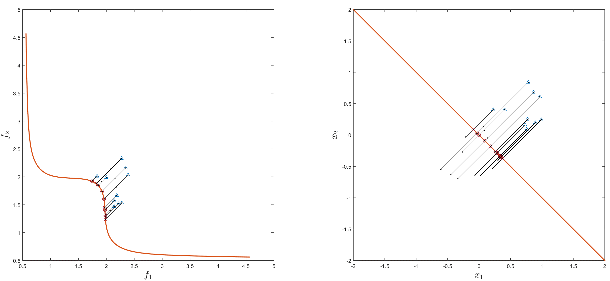
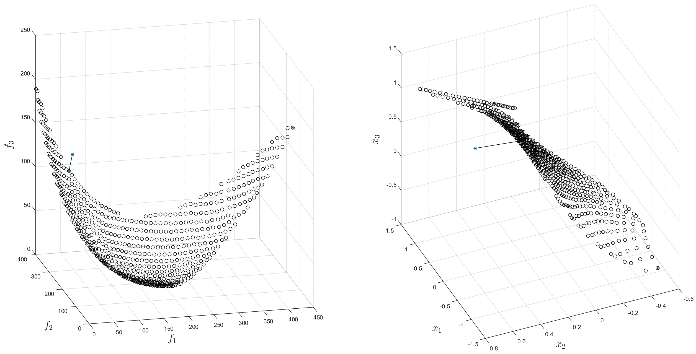
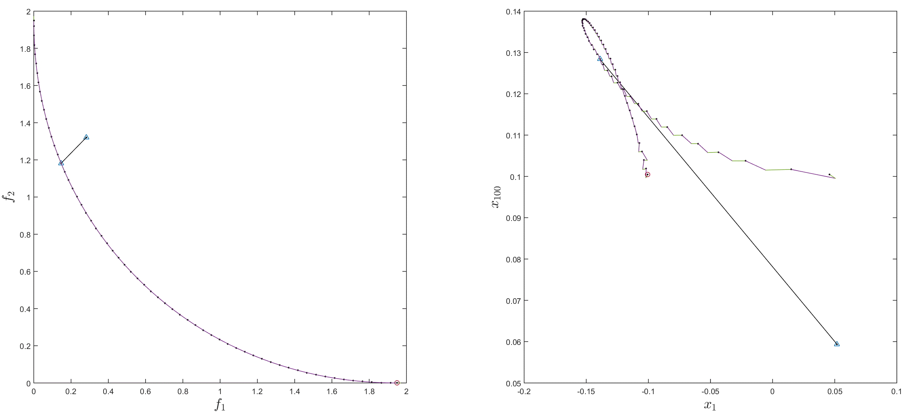

# Pareto Tracer

## Introduction
The Pareto Tracer (PT) is a predictor-corrector method for the numerical treatment of sufficiently smooth multi-objective optimization 
problems (MOP). The algorithm performs a continuation along the set of (local) solutions of a given MOP with 𝑘 objectives and can cope 
with equality and box constraints. The implementation to handle general inequalities is still under revision.
For the detailed explanations of the algorithms behind the PT we refer to: 

**[1]** A. Martín and O. Schütze<br/>
**Pareto Tracer: a predictor–corrector method for multi-objective optimization problems**<br/> 
Engineering Optimization 50 (3): 516-536, 2018<br/>
http://www.tandfonline.com/doi/abs/10.1080/0305215X.2017.1327579?journalCode=geno20

**[2]** A. Martín<br/>
**Pareto Tracer: A Predictor Corrector Method for Multi-objective Optimization Problems**<br/>
MSc Thesis, Cinvestav-IPN, Mexico, 2014<br/>
www.cs.cinvestav.mx/TesisGraduados/2014/TesisAdanayMartin.pdf

## Getting Started 
This implementation of PT was developed using MATLAB 2015. The code is organized in different packages depending on the scope. 
The main package is called **`pt`** which stands for Pareto Tracer. This contains the main entry point to the algorithm: the function 
**`pt.trace`**. 
Below there is a basic example on how to call this function. 

**`[result, stats, EXITFLAG] = pt.trace(objfun, x0, [], lb, ub, lincon, nonlcon, multfun, opts);`**

Each one of the parameters is explained later in detail. For now, another key function is introduced: **`pt.minimize`**. This function is 
utilized for the corrector phase of the algorithm. For the unconstrained case, it coincides with the Newton method proposed by 
**Fliege et al. in [3]**. A modification was proposed by **Martín et al. in [1]** to handle equality and box constraints. The current 
implementation of the pt.minimize function follows these instructions. A basic example on how to call this function is given below.

**`[result, stats, EXITFLAG] = pt.minimize(objfun, x0, [], lb, ub, lincon, nonlcon, multfun, opts);`**

**[3]** Jörge Fliege, L. M. Graña Drummond, and Benar F. Svaiter<br/> 
**Newton’s method for multiobjective optimization** <br/>
SIAM Journal on Optimization, 20(2):602–626, 2009<br/>

## Ready-to-use Examples
Several ready-to-use examples are provided, i.e., script files containing examples on how to call the PT main functions. The examples
are all grouped in two packages called **`x_trace`** and **`x_min`**. The x stands for examples or experiments, and the rest of the
folder name denotes which function is being tested. Additionally, the current experiments are grouped by the Hessian approximation 
strategy utilized in the experiment and by the function benchmark name. Finally, there is one file per experiment, **which is ready to use 
by just clicking the Run button of the MATLAB interface**. 


  
Both the plotted and printed results of running the script **`x_trace/exact/misc/quad_n100_nobj2.m`** are displayed below. The 
experiments always start on a randomly selected point on the Pareto set or close to it. Note that the starting point is a blue star 
while the last point is a red star. For bi-objective problems, PT always goes left up first, and later it goes right down the optimal 
curve.  


```
>> x_trace.exact.misc.quad_n100_nobj2

Pareto Tracer
Func: Quad(n=100,nobj=2)
Initial Point: [0.98,0.19,0.22,…]
Initial Fun Value: [33.73,231.47]
Hess: Modif: chol, Approx: bfgs (Note: Approx used only if hess not provided.)
Step in Obj: 10.00

Exit Flag (1): No more solution points found.
Iterations: 65
Solution Points: 66
Correct Stats: Avg Its: 0.03, Avg Lin Search Its: 0.03

Fun Evals: 68
Jac Evals: 68
Hess Evals: 68
Elapsed time is 2.908885 seconds.
```

Analogously, the plotted result (and part of the printed result) of running the script **`x_min/exact/misc/dent.m`** is displayed below. 
The experiments for the pt.minimize function are setup such that the algorithm is executed 10 times starting at different randomly 
selected points.


 
```
>> x_min.exact.misc.dent

PT Minimize
Func: Dent(n=2,nobj=2)
Initial Point: [0.73,0.16]
Initial Fun Value: [2.14,1.57]
Hess: Modif: chol, Approx: bfgs (Note: Approx used only if hess not provided.)

Exit (1): First-order optimality measure was less than 1.000000e-06.
Solution Point: [0.29,-0.29]
Solution Fun Value: [1.97,1.40]
Iterations: 4
Optimality: d: -1.548985e-09, ||v||^2: 3.047592e-09
Avg Dir Subprob Its: 6.00, Avg Lin Search Its: 1.00

Fun Evals: 5
Jac Evals: 5
Hess Evals: 5
Elapsed time is 0.232982 seconds.
```

One last example is provided in this section to illustrate the output of PT for a function with more than two objectives and one 
equality constraint.



```
>> x_trace.exact.eq.sproblem1_n100_nobj3

Pareto Tracer
Func: SProblem with lin eq(n=100,nobj=3,naeq=1)
Initial Point: [0.95,0.38,0.20,…]
Initial Fun Value: [32.03,244.26,143.54]
Hess: Modif: chol, Approx: bfgs (Note: Approx used only if hess not provided.)
Step in Obj: 10.00

Exit Flag (1): No more solution points found.
Iterations: 651
Solution Points: 651
Correct Stats: Avg Its: 1.30, Avg Lin Search Its: 0.93

Fun Evals: 3780
Lin Eq Evals: 2060
Jac Evals: 2039
Hess Evals: 2039
Elapsed time is 123.262057 seconds.
```

**Note**: This section has selected the most basic problems to demonstrate the capabilities of the current implementation of the algorithm. 
PT does not perform well in all benchmark problems and those examples are also included in the experiment set coming with this 
implementation. The WFG benchmark is one example of a very challenging set of functions for PT.

## Parameters
Both **`pt.trace`** and **`pt.minimize`** receive the following set of parameters:
-	**objfun**: It must be either a cell array of function handles or a struct with these fields. I.e., **`objfun = {f, J, H}`** where f, J, H are function handles that represent the objective, Jacobian, and Hessian functions respectively. They can be empty except f. J and H will be approximated if not provided. objfun can also be a function handle. In this case, it will be assumed to be the objective function only. I.e., objfun = f. 
    - **`f`**  is a function handle of the form **`y = f(x)`** where x is a vector of **`n`** components and y is a vector of **`nobj`** components.
    - **`J`**  is a function handle of the form **`y = J(x)`** where x is a vector of **`n`** components and y is a matrix of size **`(nobj x n)`**.
    - **`H`**  is a function handle of the form **`y = H(x)`** where x is a vector of **`n`** components and y is a block matrix of size **`(n x n x nobj)`**.

-	**x0**: The initial guess. It must be a vector of **`n`** dimensions. It must be specified.

-	**funvals0**: The known function values at x0. It can be empty (or any of its fields can be empty). If specified, it must be either a cell array or a struct with these fields:
**`funvals0 = {fx, Jx, Hx, ax, aeqx, cx, ceqx, dcx, dceqx, Jcx, Jceqx}`**. 
    - **`fx = objfun.f(x0)`**  % objective function
    - **`Jx = objfun.J(x0)`**  % Jacobian 
    - **`Hx = objfun.H(x0)`**  % Hessian
    - **`Ax = lincon.A * x – lincon.b`**  % linear inequalities (currently ignored)
    - **`Aeqx = lincon.Aeq * x – lincon.beq`**  % linear equalities
    - **`cx = nonlcon.c(x0)`**  % nonlinear inequalities (currently ignored)
    - **`ceqx = nonlcon.ceq(x0)`**  % nonlinear equalities
    - **`dcx = norm(ax)^2 + norm(cx)^2`**  % square norm of the inequalities (currently ignored)
    - **`dceqx = norm(aeqx)^2 + norm(ceqx)^2`**  % square norm of the equalities
    - **`Jcx = nonlcon.Jc(x0)`**  % Jacobian of the nonlinear inequalities (currently ignored)
    - **`Jceqx = nonlcon.Jceq(x0)`**  % Jacobian of the nonlinear equalities

-	**`lb, ub`**: Vectors that represent the box constraints in decision space. They must have **`n`** components or be empty.

-	**`lincon`**: It must be either a cell array of matrices or a struct with these fields. I.e., **`lincon = {A, b, Aeq, beq}`** representing the linear inequality and equality constraints. They all can be empty.
    - **`A`** is a matrix of size **`(na x n)`** where na is the number of linear inequalities (currently ignored).
    - **`b`** is a vector of **`na`** components (currently ignored).
    - **`Aeq`** is a matrix of size **`(naeq x n)`** where naeq is the number of linear equalities.
    - **`beq`** is a vector of **`naeq`** components.

-	**`nonlcon`**: It must be either a cell array of function handles or a struct with these fields. I.e., **`nonlcon = {c, ceq, Jc, Jceq}`** representing the inequality and equality constraints together with their respective Jacobians. If the Jacobians are not provided, they will be approximated. nonlcon can also be a function handle. In this case, it will be assumed to be the nonlinear inequality constraints function only. I.e., nonlcon = c.
    - **`c`** is a function handle of the form **`y = c(x)`** where x is a vector of **`n`** components and y is a vector of **`nc`** components (currently ignored).
    - **`ceq`** is a function handle of the form **`y = ceq(x)`** where x is a vector of **`n`** components and y is a vector of **`nceq`** components.
    - **`Jc`** is a function handle of the form **`y = Jc(x)`** where x is a vector of **`n`** components and y is a matrix of size **`(nc x n)`** (currently ignored).
    - **`Jceq`** is a function handle of the form **`y = Jceq(x)`** where x is a vector of **`n`** components and y is a matrix of size **`(nceq x n)`**.

-	**`multfun`**: It must be either a cell array of function handles or a struct with these fields. I.e., **`multfun = {vH, Hw, Hwv}`** representing the Hessian multiply functions. They all can be empty. If specified, the multiply functions will be utilized instead of the Hessian function.
    - **`vH`** is a function handle of the form **`y = vH(x, v)`** where **`y = [v' * H1; v' * H2; ...; v' * Hnobj]`**. The result y has a size of **`(nobj x n)`**.
    - **`Hw`** is a function handle of the form **`y = Hw(x, w)`** where **`y = H1 * w1 + H2 * w2 + ... + Hnobj * wnobj`**. The result y has a size of **`(n x n)`**, i.e., the weighted sum of Hessians.
    - **`Hwv`** is a function handle of the form **`y = Hwv(x, w, v)`** where **`y = (H1 * w1 + H2 * w2 + ... + Hnobj * wnobj) * v`**. The result y is a vector of **`n`** components.

-	**`opts`**: This is a structure containing all the options that can be passed to the algorithms. There is a separate section dedicated to this. 

**Important**: The implementation to handle general inequalities is still under revision. However, all functions are already prepared to receive general constraints. For now, all parameters related to inequalities are being ignored.

## Output
Both **`pt.trace`** and **`pt.minimize`** return the same set of output parameters **`[result, stats, EXITFLAG]`** although the nature of these differs in both algorithms.

### pt.trace Output
-	**`result`**: Describes the solution. It is a struct with the following fields:
    - **`ps`**: The (local) Pareto set of the problem: A matrix of size **`(m x n)`** where **`m`** is the number of solutions found and **`n`** is the number of variables.
    - **`pf`**: The (local) Pareto front of the problem: A matrix of size **`(m x nobj)`** where **`m`** is the number of solutions found and **`nobj`** is the number of objectives.

-	**`Stats`**: Statistics.
    - **`Count`**: Number of solutions found.
    - **`PCIts`**: Number of iterations taken by the continuation algorithm, where each iteration consists of 
        - one predictor stage (one or more predictor vectors are computed),
        - and one corrector (minimization) stage (those predictors are corrected).
    - **`OptIts`**: Average iterations taken by the corrector (minimization) algorithm.
    - **`OptDirIts`**: Average iterations taken by the corrector direction subproblem.
    - **`OptLsIts`**: Average backtrack iterations taken by the corrector line search to satisfy the Armijo condition.
    - **`fCount`**: Number of function evaluations.
    - **`JCount`**: Number of Jacobian evaluations.
    - **`HCount`**: Number of Hessian evaluations.
    - **`vHCount, HwCount, HwvCount`**: Multiply function evaluations.
    - **`aCount`**: Number of linear inequality constraint evaluations **`(A * x - b)`** (currently ignored).
    - **`aeqCount`**: Number of linear equality constraint evaluations **`(Aeq * x - beq)`**.
    - **`cCount`**: Number of nonlinear inequality constraint evaluations (currently ignored).
    - **`ceqCount`**: Number of nonlinear equality constraint evaluations.
    - **`JcCount`**: Number of nonlinear inequality constraint Jacobian evaluations (currently ignored).
    - **`JceqCount`**: Number of nonlinear equality constraint Jacobian evaluations.

-	**`EXITFLAG`**: Describes the exit condition.
    - **`0`**: Number of iterations exceeded **`opts.PCMaxIts`**.
    - **`1`**: No more solution points found.
    - **`-1`**: Stopped by an output function.
    
### pt.minimize Output
-	**`result`**: Describes the solution. It is a struct with the following fields:
    - **`x, fx, Jx, Hx`**: Respectively the solution, and the value of the objective functions, Jacobian, and Hessians (if available).
    - **`ax, aeqx`**: Respectively the values of the linear inequality and equality constraints (if available).
    - **`cx, ceqx`**: Respectively the values of the nonlinear inequality and equality constraints (if available).
    - **`dcx, dceqx`**: Respectively the square norm of the nonlinear inequality and equality constraints (if available).
    - **`Jcx, Jceqx`**: Respectively the values of the Jacobians of the nonlinear inequality and equality constraints (if available).
    - **`w`**: Structure with the Lagrange multipliers (if computed).
        - **`objectives`**: Objective functions.
        - **`lower`**: Lower bounds.
        - **`upper`**: Upper bounds.
        - **`ineqlin`**: Linear inequalities.
        - **`eqlin`**: Linear equalities.
        - **`ineqnonlin`**: Nonlinear inequalities.
        - **`eqnonlin`**: Nonlinear equalities.
    - **`v`**: Search direction (if computed) at the solution.
    - **`d`**: Measure of the objectives decrease (if computed) at the solution. The vector **`(v,d)`** is the result of the direction subproblem.
    - **`t`**: Step length (if computed) at the solution.
    - **`FirstOrdOpt`**: Measure of the first-order optimality.

-	**`stats`**: Statistics.
    - **`OptIts`**: Number of iterations taken. The iterations only increment if a new value of x is computed.
    - **`OptDirIts`**: Average iterations taken by the direction subproblem.
    - **`OptLsIts`**: Average backtrack iterations taken by the line search to satisfy the Armijo condition.
    - **`fCount`**: Number of function evaluations.
    - **`JCount`**: Number of Jacobian evaluations.
    - **`HCount`**: Number of Hessian evaluations.
    - **`vHCount, HwCount, HwvCount`**: Multiply function evaluations.
    - **`aCount`**: Number of linear inequality constraint evaluations **`(A * x - b)`** (currently ignored).
    - **`aeqCount`**: Number of linear equality constraint evaluations **`(Aeq * x - beq)`**.
    - **`cCount`**: Number of nonlinear inequality constraint evaluations (currently ignored).
    - **`ceqCount`**: Number of nonlinear equality constraint evaluations.
    - **`JcCount`**: Number of nonlinear inequality constraint Jacobian evaluations (currently ignored).
    - **`JceqCount`**: Number of nonlinear equality constraint Jacobian evaluations.

-	**`EXITFLAG`**: Describes the exit condition.
    - **`0`**: Number of iterations exceeded **`opts.OptMaxIts`**.
    - **`1`**: First-order optimality measure was less than **`opts.FirstOrdOptTol`**.
    - **`2`**: Change in x too small.
    - **`-1`**: Stopped by an output function.
    - **`-2`**: No feasible point was found.

## Options
The behavior of **`pt.trace`** and **`pt.minimize`** can be configured by the following set of options that can be passed in a structure as the last parameter of both algorithms.
The default set of options can be obtained by calling the function **`pt.defopts(n, nobj)`**. The parameters n and nobj are optional.

Probably the most relevant option in this section is **`PCStepObj`**. This setting defines the desired distance between optimal points in objective space and is problem-dependent. It is set by default to 0.1 but it should be adjusted by the user depending on the problem scale. PT will then estimate the distance between points in decision space such that the correspoding objective values are separated by approximately **`PCStepObj`** in objective space. PT calculates distances using the Euclidean norm. 

-	**`HessApprox`**: Ignored if the Hessian or the Hessian multiply functions are provided.
    - **`'bfgs'`** (default): A Quasi-Newton BFGS update is used for each Hessian. 
    - **`'off'`**: A steepest descent method is performed, i.e., the Hessians are assumed to be the identity matrix.
    - **`'fd'`**: Finite differences are used to approximate all the Hessians.
-	**`HessModif`**: Defines the type of modification applied to the Hessians to ensure they are positive definite.
    - **`'chol'`**: Modified Cholesky decomposition. This is the default.
    - **`'off'`**: No modification is performed.
-	**`FunValCheck`**: **`true/false`**. Checks whether the objective function values are valid. If true, displays an error when the objective function returns a value that is complex, NaN, or Inf. If the Jacobian is not valid, a warning will be thrown, and the Jacobian will be approximated by FD. Same for the Hessians, but they can also be updated by QN, or approximated to the identity matrix (depending on the HessApprox choice).
-	**`LargeScale`**: **`false/true`**. If the problem is large scale, a matrix of size **`(n x n)`** will never be formed unless the Hessian is provided, the multiply function Hw is provided, or opts.HessApprox = 'bfgs'. Only matrices of size **`(nobj x n)`** (same size as the Jacobian) will be formed.  
-	**`PCMaxIts`**: **`10000`**. Max number of iterations allowed to the continuation algorithm, where each iteration consists of 
    - a predictor stage (one or several predictors around a point),
    - and a corrector (optimization) stage (those predictors are corrected).
-	**`PCGMaxIts`**: **`20`**. Max no of iterations allowed to the PCG algorithm utilized in the predictor phase. 
-	**`OptMaxIts`**: **`100`**. Max number of iterations allowed to optimization algorithms.
-	**`OptDirSolver`**: fmincon. Solver utilized to solve the optimization direction subproblem.
-	**`OptDirMaxIts`**: **`20`**. Max number of iterations allowed to the optimization direction subproblem.
-	**`OptLsMaxIts`**: **`20`**. Max number of iterations allowed to the linear search strategy of optimization algorithms.
-	**`ArmijoC`**: **`0.1`**. Constant utilized by linear searches in optimization algorithms.
-	**`FirstOrdOptTol`**: **`1e-6`**. First order optimality tolerance.
-	**`OptMinStepVar`**: **`1e-10`**. Lower bound on the length of a step. The optimization algorithm will stop if the newly computed point is too close to the previous one.
-	**`ConstViolTol`**: **`1e-6`**. Tolerance on the constraint violation.
-	**`ConstActiveTol`**: **`1e-6`**. Tolerance utilized to determine whether a variable is active with respect to the constraints.
-	**`PCEdgeTol`**: **`1e-3`**. If there is a component of alpha (Lagrange multiplier corresponding to the objective functions) below this tolerance, the current iteration point is on an edge.
-	**`PCStepObj`**: **`0.1`**. Scalar step length in objective space. This setting defines the desired distance between optimal points in objective space and is problem-dependent. It is set by default to 0.1 but it should be adjusted by the user depending on the problem scale. PT will then estimate the distance between points in decision space such that the correspoding objective values are separated by approximately **`PCStepObj`** in objective space. PT calculates distances using the Euclidean norm.
-	**`PCMinRelStepObj`**: **`0.1`**. If the relative step length (regarding **`PCStepObj`**) is below this tolerance, the new point will be discarded.
-	**`PCMaxRelStepObj`**: **`10`**. If the relative step length (regarding **`PCStepObj`**) is above this tolerance, the new point will be discarded.
-	**`LbObj`**: **`[]`**. Vector representing the lower bounds in objective space.
-	**`UbObj`**: **`[]`**. Vector representing the upper bounds in objective space.
-	**`PCForceCells`**: **`false/true`**. Force the use of space cells even if the problem is bi-objective. The implementation of space cells is based on [4]. This is a data structure utilized to keep track of which part of the optimal manifold is already traced and is based on a subdivision of the objective space into boxes. Space cells are mandatory for nobj > 2. Thus, this setting is applicable only to bi-objective problems. 
-	**`PCForceSecant`**: **`false/true`**. Force the use of secants to be used as tangents in the predictor phase. This setting is applicable only to bi-objective problems.
-	**`InitSetSize`**: **`100`**. Initial array length for variable length arrays, e.g. the computed solution set of a PC algorithm.
-	**`SetSizeGrowFact`**: **`1.5`**. Grow factor for variable length arrays.

**[4]** O. Schütze<br/>
**Set Oriented Methods for Global Optimization**<br/> 
PhD thesis, University of Paderborn, 2004<br/>
http://digital.ub.uni-paderborn.de/ubpb/urn/urn:nbn:de:hbz:466-20040101418

### Finite Differences (FD) Options
-	**`FDType`**: FD, used to estimate gradients, are either: 
    - **`'forward'`** (the default), or 
    - **`'central'`**, which takes twice as many function evaluations but should be more accurate.
    
**Note**: Central FD is not currently supported.

-	**`TypicalX`**: **`1`**. Scalar or vector that specifies typical magnitude of variables.
-	**`FDMinChange`**: **`0`**. Minimum change allowed in variables.
-	**`FDMaxChange`**: **`Inf`**. Maximum change allowed in variables.
-	**`FDStepSize`**: **`sqrt(eps)`**. Scalar or vector step size factor. When you set it to a vector t, the change in variables is calculated as:<br/>
  `e = t .* max(abs(x), abs(TypicalX)) .* sign'(x);`
where sign'(x) is -1 for x < 0 and 1 for x >= 0. 
-	**`FDStepSize2`**: **`eps^(1/3)`**. Same as above but used for central finite differences or when the Jacobian is not provided when approximating Hessians. For central finite differences, when set it to a vector t, the change in variables is calculated as:<br/>
  `e = t .* max(abs(x), abs(TypicalX));`
-	**`UseVectorized`**: Defines whether multiple values of the function can be obtained with a single call to f, e.g., Y = f(X) where X is a matrix where each row represents a single individual, and analogously, Y is a matrix where each row represents a function evaluation. For the Jacobian function it is similar. If X has a size of (m x n), Y = J(X) will have a size of (m x nobj x n). The default is false.
-	**`FDForceHess`**: When using FD, defines whether to approximate a full Hessian at each iteration instead of several products (v' * H). By default, it is false, or true if n <= 5. If opts.LargeScale is specified, this setting has no effect as the idea is not to form (n x n) matrices. Thus, the product (v' * H) will be favored.

### Printing and Plotting Options
The following options are all related to the printing and plotting capabilities of **`pt.trace`** and **`pt.minimize`**. Basically, the entire output can be replaced by specifying custom output function handles.

-	**`PCOutFcn`**: Function to display info or to stop the PC algorithm. It is also used to discard the current predictor or corrector points. It has the following format:<br/>
  **`function [stop, discard, it1, itp, itc] = pcoutfcn(info)`**
where info is a structure containing the current variables being utilized by the algorithm:
    - **`it0, it1`**: Previous and current iteration structures. See **`pt.traceit`** for the list of fields. The `pt.traceit` function is an auxiliary function to build the iteration structures utilized to store temporal data as function values etc. per iteration.
    - **`itp, itc`**: Current predictor or corrector structures (depending on the **`PHASEFLAG`**). See `pt.traceit` for the list of fields.  
    - **`objfun, x0, funvals0, lb, ub, lincon, nonlcon, multfun, opts`**: The input parameters to the continuation function.
    - **`result, stats, EXITFLAG`**: The output parameters of the continuation function.
    - **`PHASEFLAG`** 
        - **`'INIT'`**: The algorithm is ready to start.
        - **`'IT-INIT'`**: The current iteration is ready to start.
        - **`'PRED'`**: A new predictor was just computed.
        - **`'CORRECT'`**: A new corrector was just computed.
        - **`'SAVE'`**: The corrector was saved.  
        - **`'IT-FINIT'`**: The current iteration is about to finish.
        - **`'FINIT'`**: The algorithm has finished.
    - Additionally, if **`stop = true`** is returned, the algorithm will stop.
    - If **`discard = true`** is returned, the current predictor or corrector point will be discarded.
    - If **`it1, itp, itc, stats`**, are returned, they will replace the values utilized by the algorithm.    
    
**Note**: The current implementation comes with one default output function for pt.trace. See **`pt.traceout`**. This function internally uses **`pt.traceprint`** and **`pt.traceplot`**. These can be used as starting points for customized output functions.

The following options are designed to be utilized by the output (printing and plotting) functions only.

-	**`MOPName`**: Name of the multi-objective optimization problem (MOP) being solved. 
-	**`PCIndent, OptIndent`**: Initial indentation for the output of the algorithms. By default it is ''.
-	**`IndentGrowFactor`**: It is '  ' by default.
-	**`PCSuppressOutput, PCSuppressPrint, PCSuppressPlot, 
OptSuppressOutput, OptSuppressPrint, OptSuppressPlot`**: Controls the output. They are all **`false`** by default.
-	**`OptPrintMode`**: **`'off', 'iter', 'result'`**. The default is **`'result'`**.
-	**`PCPrintMode`**: **`'off', 'iter', 'result'`**. The default is **`'result'`**.
-	**`OptPlotMode`**: **`'off', 'iter', 'result'`**. The default is **`'iter'`**.
-	**`PCPlotMode`**: **`'off', 'iter', 'result', 'flow'`**. The default is **`'result'`**.
    - The choice **`'iter'`** plots the predictor and corrector steps. Following one example of how the setting `'iter'` would look like. Note that the predictors are magenta, and the correctors are green. Execute the script **`x_trace.bfgs.eq.sproblem2_n100_nobj2`** for a similar result.

    - The choice **`'flow'`** determines whether to plot a line between the previous and current corrector. By default, it is true for the bi-objective case and false for the general case. Below there is an example of how this setting would look like. Check **`x_trace.bfgs.dtlz.cdtlz2_n100_nobj3`**.    

 -	**`OptOutFcn`**: Function to display info or to stop the optimization algorithm. It has the following format:<br/>
**`function [stop, it1, it2, stats] = optoutfcn(info)`**<br/>
where info is a structure containing the current variables being utilized by the algorithm:
    - **`it0, it1, it2`**: Previous, current, and next iteration structures. See **`pt.minit`** for the list of fields. The pt.minit function is an auxiliary function to build the iteration structures utilized to store temporal data as function values etc. per iteration.
    - **`objfun, x0, funvals0, lb, ub, lincon, nonlcon, multfun, opts`**: The input parameters to the optimization function.
    - **`result, stats, EXITFLAG`**: The output parameters of the optimization function.
    - **`PHASEFLAG`** 
        - **`'INIT'`**: The algorithm is ready to start.
        - **`'IT-INIT'`**: The current iteration is ready to start.
        - **`'DIR'`**: The descent direction was just computed.
        - **`'STEP'`**: The step length was just computed.
        - **`'IT-FINIT'`**: The current iteration is about to finish.
        - **`'FINIT'`**: The algorithm has finished.
    - **`DIREXITFLAG`**: Exit condition of the direction subproblem algorithm.
    - **`OptDirIts`**: No of iterations performed by the direction subproblem solver.
    - **`LSEXITFLAG`**: Exit condition of the line search algorithm.
    - **`OptLsIts`**: No of iterations performed by the line search.
    - Additionally, if **`stop = true`** is returned, the algorithm will stop.
    - If **`it1, it2, stats`** are returned, they will replace the values utilized by the algorithm.
    
**Note**: The current implementation comes with one default output function for pt.minimize. See **`pt.minout`**. This function internally uses **`pt.minprint`** and **`pt.minplot`**. These can be used as starting points for customized output functions.

-	**`PCDrawCells`**: **`false/true`**. Determines whether to draw the computed cells. An example of this setting is illustrated later.
-	**`PlotAxesPartition1, PlotAxesPartition2`**: Breaks the Figure window into an **`m-by-n`** matrix of small axes. By default, it is **`(1 x 2)`**, i.e., one partition for the objective space and another partition for the decision space.
-	**`PlotPSAxesInd, PlotPFAxesInd`**: Indices of the axes where the PS and the PF will be plotted. 0 means that they are not plotted. By default, they are 2 and 1 respectively.
-	**`PlotPSDims, PlotPFDims`**: Respectively the dimensions of the PS and PF to be plotted. By default they are both **`1 : 3`**.


