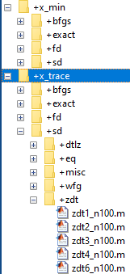
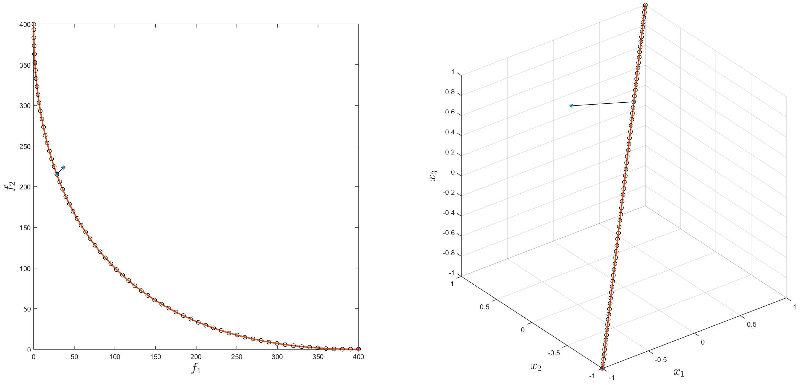

# ParetoTracer

## Introduction
The Pareto Tracer (PT) is a predictor-corrector method for the numerical treatment of sufficiently smooth multi-objective optimization 
problems (MOP). The algorithm performs a continuation along the set of (local) solutions of a given MOP with 𝑘 objectives and can cope 
with equality and box constraints. 
For the detailed explanations of the algorithms behind the PT we refer to: 

**[1]** A. Martín and O. Schütze<br/>
**Pareto Tracer: a predictor–corrector method for multi-objective optimization problems**<br/> 
Engineering Optimization 50 (3): 516-536, 2018<br/>
http://www.tandfonline.com/doi/abs/10.1080/0305215X.2017.1327579?journalCode=geno20

**[2]** A. Martín<br/>
**Pareto Tracer: A Predictor Corrector Method for Multi-objective Optimization Problems**<br/>
MSc Thesis, Cinvestav-IPN, Mexico, 2014<br/>
www.cs.cinvestav.mx/TesisGraduados/2014/TesisAdanayMartin.pdf

## Getting Started 
This implementation of PT was developed using MATLAB 2015. The code is organized in different packages depending on the scope. 
The main package is called **`pt`** which stands for Pareto Tracer. This contains the main entry point to the algorithm: the function 
**`pt.trace`**. 
Below there is a basic example on how to call this function. 

**`[result, stats, EXITFLAG] = pt.trace(objfun, x0, [], lb, ub, lincon, nonlcon, multfun, opts);`**

Each one of the parameters is explained later in detail. For now, another key function is introduced: **`pt.minimize`**. This function is 
utilized for the corrector phase of the algorithm. For the unconstrained case, it coincides with the Newton method proposed by 
**Fliege et al. in [3]**. A modification was proposed by **Martín et al. in [1]** to handle equality and box constraints. The current 
implementation of the **`pt.minimize`** function follows these instructions. A basic example on how to call this function is given below.

**`[result, stats, EXITFLAG] = pt.minimize(objfun, x0, [], lb, ub, lincon, nonlcon, multfun, opts);`**

**[3]** Jörge Fliege, L. M. Graña Drummond, and Benar F. Svaiter.<br/> 
**Newton’s method for multiobjective optimization.** <br/>
SIAM Journal on Optimization, 20(2):602–626, 2009.<br/>

## Ready-to-use Examples
Several ready-to-use examples are provided, i.e., script files containing examples on how to call the PT main functions. The examples
are all grouped in two packages called **`x_trace`** and **`x_min`**. The x stands for examples or experiments, and the rest of the
folder name denotes which function is been tested. Additionally, the current experiments are grouped by the Hessian approximation 
strategy utilized in the experiment and by the function benchmark name. Finally, there is one file per experiment, **which is ready to use 
by just clicking the Run button of the MATLAB interface**. 


  
Both the plotted and printed results of running the script **`x_trace/exact/misc/quad_n100_nobj2.m`** are displayed below. The 
experiments always start on a randomly selected point on the Pareto set or close to it. Note that the starting point is a blue star 
while the last point is a red star. For bi-objective problems, PT always goes left up first, and later it goes right down the optimal 
curve.  



```
>> x_trace.exact.misc.quad_n100_nobj2

Pareto Tracer
Func: Quad(n=100,nobj=2)
Initial Point: [0.98,0.19,0.22,…]
Initial Fun Value: [33.73,231.47]
Hess: Modif: chol, Approx: bfgs (Note: Approx used only if hess not provided.)
Step in Obj: 10.00

Exit Flag (1): No more solution points found.
Iterations: 65
Solution Points: 66
Correct Stats: Avg Its: 0.03, Avg Lin Search Its: 0.03

Fun Evals: 68
Jac Evals: 68
Hess Evals: 68
Elapsed time is 2.908885 seconds.
```

Analogously, the plotted result (and part of the printed result) of running the script **`x_min/exact/misc/dent.m`** is displayed below. 
The experiments for the pt.minimize function are setup such that the algorithm is executed 10 times starting at different randomly 
selected points.
 
```
>> x_min.exact.misc.dent

PT Minimize
Func: Dent(n=2,nobj=2)
Initial Point: [0.73,0.16]
Initial Fun Value: [2.14,1.57]
Hess: Modif: chol, Approx: bfgs (Note: Approx used only if hess not provided.)

Exit (1): First-order optimality measure was less than 1.000000e-06.
Solution Point: [0.29,-0.29]
Solution Fun Value: [1.97,1.40]
Iterations: 4
Optimality: d: -1.548985e-09, ||v||^2: 3.047592e-09
Avg Dir Subprob Its: 6.00, Avg Lin Search Its: 1.00

Fun Evals: 5
Jac Evals: 5
Hess Evals: 5
Elapsed time is 0.232982 seconds.
```

One last example is provided in this section to illustrate the output of PT for a function with more than two objectives and one 
equality constraint.

```
>> x_trace.exact.eq.sproblem1_n100_nobj3

Pareto Tracer
Func: SProblem with lin eq(n=100,nobj=3,naeq=1)
Initial Point: [0.95,0.38,0.20,…]
Initial Fun Value: [32.03,244.26,143.54]
Hess: Modif: chol, Approx: bfgs (Note: Approx used only if hess not provided.)
Step in Obj: 10.00

Exit Flag (1): No more solution points found.
Iterations: 651
Solution Points: 651
Correct Stats: Avg Its: 1.30, Avg Lin Search Its: 0.93

Fun Evals: 3780
Lin Eq Evals: 2060
Jac Evals: 2039
Hess Evals: 2039
Elapsed time is 123.262057 seconds.
```

Note: This section has selected the most basic problems to demonstrate the capabilities of the current implementation of the algorithm. 
PT does not perform well in all benchmark problems and those examples are also included in the experiment set coming with this 
implementation. The WFG benchmark is one example of a very challenging set of functions for PT.

